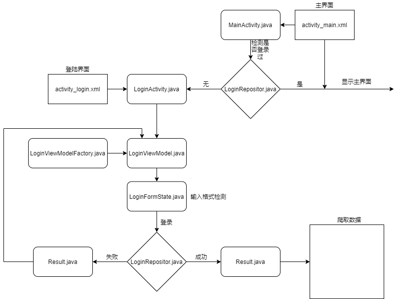

# 项目介绍

通过抓取微信企业号中的课表信息 **实现在桌面添加课表widget**从而避免频繁查课表或将课表设为桌面壁纸

# 程序逻辑框图

UML一直没耐心学，自己随便画的:cry:

画图是为了说明/理清一些类的功能和各类之间的联系

# 项目进度

#### 2020.2.3

* 实现使用Jsoup抓取目标（课表）信息
* 登录界面设计完成

#### 2020.2.4

* 记住用户名和密码(使用SharedPreferences)

#### 2020.2.5

* 实现抓取数据并重构(Gson)
* 完成SQLite的密码保存Class
* 完成SQLite的课程信息保存Class
  * 课程储存于数据库的格式（尽量减少不需要的数据） : 
    * (STRING)INDEX: YYYY-MM-DD-TT(年-月-日-节)
    * (STRING)NAME:课程名称
    * (STRING)LOCATION:上课地点
    * (STRING)TEACHER:教师名称
    * (INT)TOTALLENGTH:课程长度
* 完成登录部分程序逻辑框图(draw.io)

#### 2020.2.6

* 检查输入合法性(ViewModelProvider)
* 重新整理登录逻辑（程序逻辑框图.drawio）
* 实现登录过程模拟
* 登录状况的判断（SharedPreference)
* 增加退出登录的功能
* 添加保存课程信息的数据库类(SQLite)

#### 2020.2.7

* :sweat:觉得使用安卓的登录框架（ViewModelProvider）限制了我，程序被设置的越来越复杂了
* 移植登录程序(AsyncTask)
* 保存cookies到本地(SharedPreference)
* 连接超时处理
* 爬虫移植(AsyncTask)

#### 2020.2.8

* 解析至SQLite数据库保存格式（Gson）
* 抓取信息保存到本地(SQLite)
* 完成粗糙主界面 （[revolvingweekview](https://github.com/jlurena/revolvingweekview) ）

#### 2020.2.9

* 搬运MD课表中的桌面插件（未移植）[mnnyang](https://github.com/mnnyang)/**[ClassSchedule](https://github.com/mnnyang/ClassSchedule)**
* 侧面导航栏完成一半

#### 2020.2.10

* 完成侧面导航栏，移植完毕

  * 主页
  * 设置
    * 当前学期
    * 刷新数据
    * 退出登录

  * 反馈>
  * 关于>
* 配置主页

#### 2020.2.11

* 成功显示到当前周到主页面
* 更换图标与名称

#### 2020.2.12

* home page完成，范围约束到1-18周，可显示每天的日期

# 待办

* 移植桌面插件
* 设置页面
* 反馈页面
* 关于页面
* 更新、反馈方法
* 美化

## optional

* 使用SQLite记住用户名密码（安全性更高）

# 对我有帮助的文章/lib

[使用 SQLite 保存数据](https://developer.android.com/training/data-storage/sqlite?hl=zh_cn#java)

[SQLiteDemo](https://github.com/limit-DNE/SQLiteDemo)

[Add a “Remember me” checkbox](https://stackoverflow.com/questions/9370293/add-a-remember-me-checkbox)

 [Android sqlite how to check if a record exists](https://stackoverflow.com/questions/20415309/android-sqlite-how-to-check-if-a-record-exists)

[Android Widgets](https://medium.com/android-bits/android-widgets-ad3d166458d3)

[mnnyang](https://github.com/mnnyang)/**[ClassSchedule](https://github.com/mnnyang/ClassSchedule)**

[google](https://github.com/google)/**[gson](https://github.com/google/gson)**

[GSON throwing “Expected BEGIN_OBJECT but was BEGIN_ARRAY”?](https://stackoverflow.com/questions/9598707/gson-throwing-expected-begin-object-but-was-begin-array)

[Gson解析多层嵌套复杂数据](https://my.oschina.net/ydsakyclguozi/blog/480050)

 [【Android】数据存储（一） SharedPreferences详解](https://www.jianshu.com/p/59b266c644f3)

[Android Navigation Drawer Tutorial using Fragments - Updated](https://www.youtube.com/watch?v=J8GB_b8qyK8)

[Understanding AsyncTask – Once and Forever](https://androidresearch.wordpress.com/2012/03/17/understanding-asynctask-once-and-forever/)

 [jlurena](https://github.com/jlurena)/**[revolvingweekview](https://github.com/jlurena/revolvingweekview)**

[Android Intents - Tutorial](https://www.vogella.com/tutorials/AndroidIntent/article.html)

