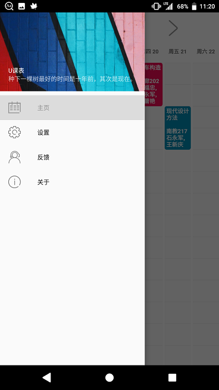
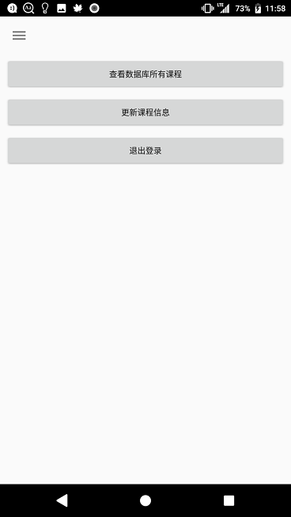

# 软件介绍

仅适用于 `中国石油大学(华东)` 的一款课程表软件，支持添加小部件至桌面，不支持显示小学期课程。

现已上架[酷安网](https://coolapk.com/apk/com.ws.upc_schedule)

**若使用本软件，请确保在每次更新完课程数据后都与课程信息源进行核对，确定数据正确才使用。**

> 课程信息源为：微信石大企业号-教务信息-微查询-学生课表

### 软件特色：

* 无中心服务器，信息爬取与解析完全在本地进行，保证个人信息安全，密码在登录后就销毁，之后使用cookies更新数据
* 使用桌面小插件，可以方便地查看课程

    

[TOC]

# 版本说明

### 1.1(未完成)

* 减小`周`栏的字体大小
* 修复了许多场景下需要强行停止应用才能更新数据的问题
* 增加颜色库，而不是使用随机颜色，颜色再也不会那么奇怪了

### 1.0

增加了点击小部件`星期`栏更新小部件功能

增加了一个打开导航栏的按键

增加了`返回当前周`的提示

删除`使用QQ联系开发者`的功能

修复了小部件左侧节数与课程没对齐的bug

修复`退出登录`时用户数据清除不完全的bug

### 0.9BETA

完成基本功能

# [初始项目开发日志](log.md)

# 开发本软件使用到的开源库、App及文章（感谢）

### App

[mnnyang](https://github.com/mnnyang)/**[ClassSchedule](https://github.com/mnnyang/ClassSchedule)**（licensed under the **Apache License 2.0**）

 [limit-DNE](https://github.com/limit-DNE)/**[SQLiteDemo](https://github.com/limit-DNE/SQLiteDemo)**

### 第三方库

[google](https://github.com/google)/**[gson](https://github.com/google/gson)**

 [jlurena](https://github.com/jlurena)/**[revolvingweekview](https://github.com/jlurena/revolvingweekview)**

 [jhy](https://github.com/jhy)/**[jsoup](https://github.com/jhy/jsoup)**

### 文章/教程

[使用 SQLite 保存数据](https://developer.android.com/training/data-storage/sqlite?hl=zh_cn#java)

[SQLiteDemo](https://github.com/limit-DNE/SQLiteDemo)

[Add a “Remember me” checkbox](https://stackoverflow.com/questions/9370293/add-a-remember-me-checkbox)

 [Android sqlite how to check if a record exists](https://stackoverflow.com/questions/20415309/android-sqlite-how-to-check-if-a-record-exists)

[Android Widgets](https://medium.com/android-bits/android-widgets-ad3d166458d3)

[GSON throwing “Expected BEGIN_OBJECT but was BEGIN_ARRAY”?](https://stackoverflow.com/questions/9598707/gson-throwing-expected-begin-object-but-was-begin-array)

[Gson解析多层嵌套复杂数据](https://my.oschina.net/ydsakyclguozi/blog/480050)

 [【Android】数据存储（一） SharedPreferences详解](https://www.jianshu.com/p/59b266c644f3)

[Android Navigation Drawer Tutorial using Fragments - Updated](https://www.youtube.com/watch?v=J8GB_b8qyK8)

[Understanding AsyncTask – Once and Forever](https://androidresearch.wordpress.com/2012/03/17/understanding-asynctask-once-and-forever/)

[Android Intents - Tutorial](https://www.vogella.com/tutorials/AndroidIntent/article.html)

[Java – Add days to Date](https://beginnersbook.com/2017/10/java-add-days-to-date/)

[Start new Activity and finish current one in Android? duplicate](https://stackoverflow.com/questions/11308198/start-new-activity-and-finish-current-one-in-android)

[AsyncTask](https://developer.android.com/reference/android/os/AsyncTask)

